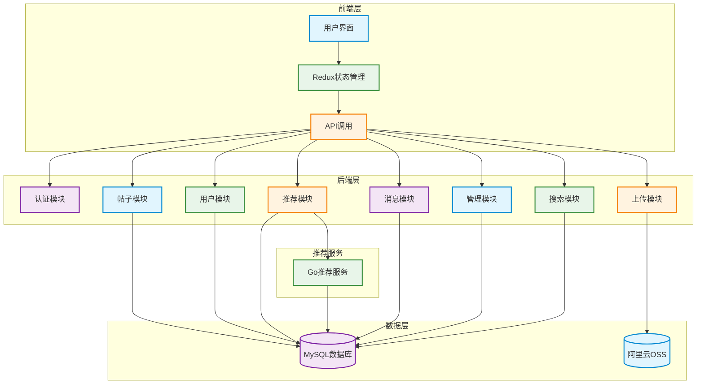
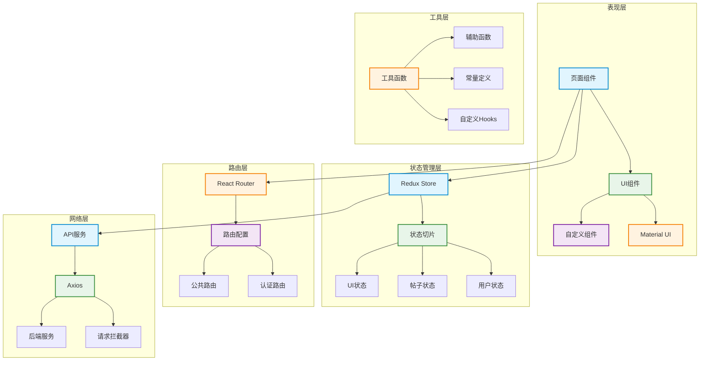
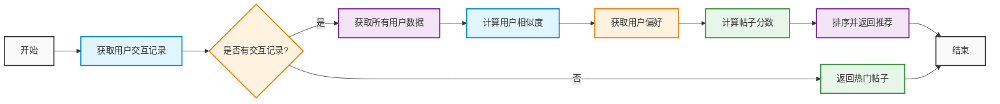
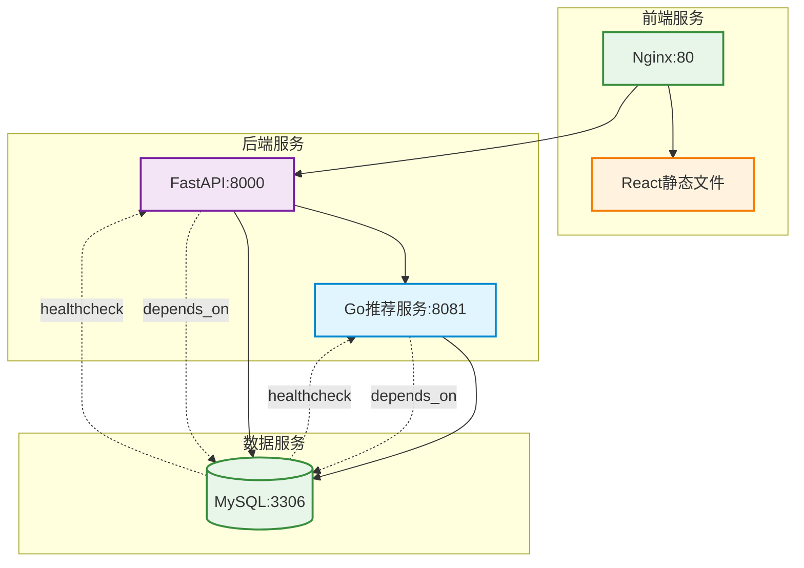
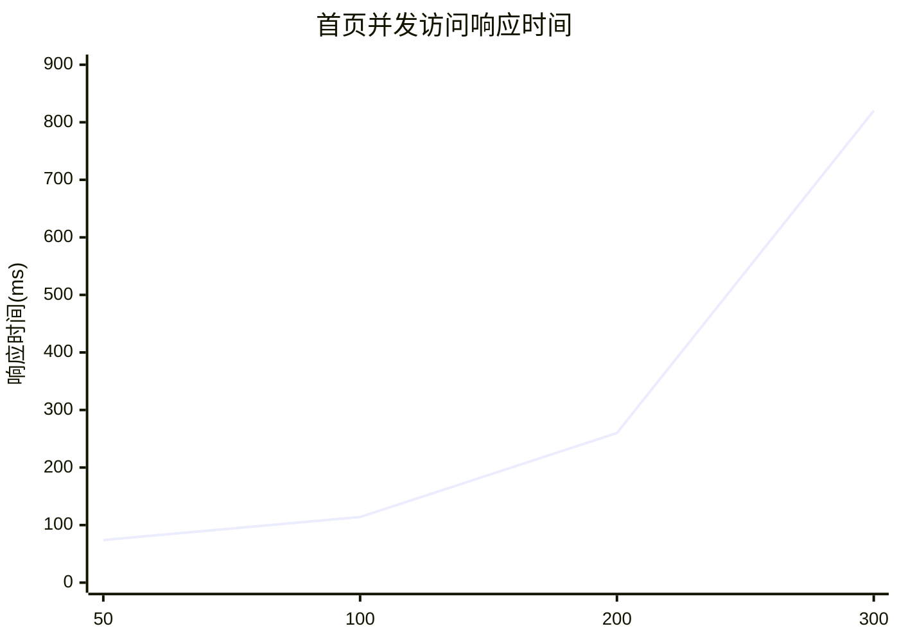
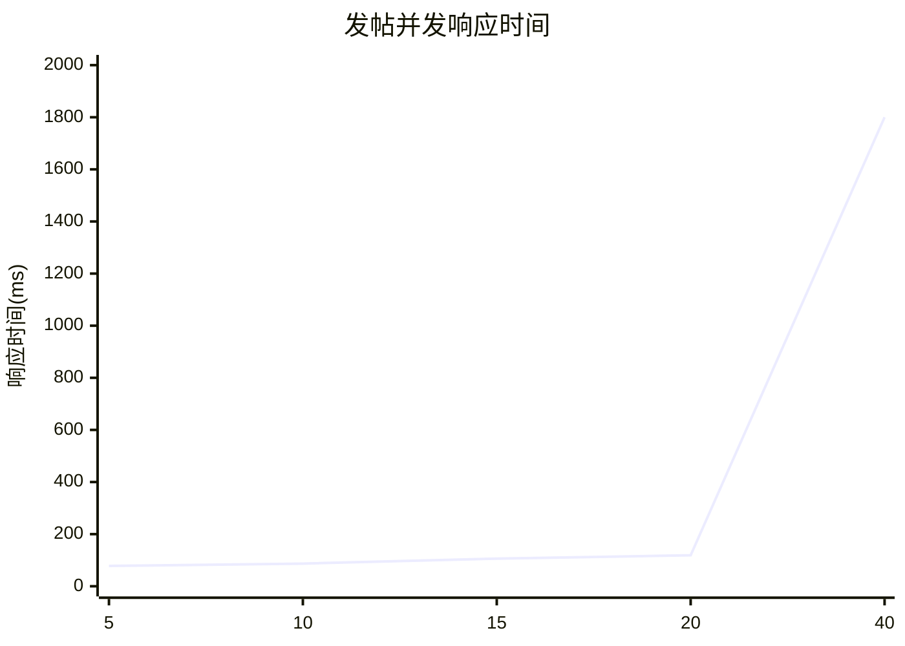

---
# You can also start simply with 'default'
theme: seriph
# random image from a curated Unsplash collection by Anthony
# like them? see https://unsplash.com/collections/94734566/slidev
background: /images/bg.png
# some information about your slides (markdown enabled)
title: 毕业设计答辩
info: |
  毕业设计答辩演示文稿
# apply unocss classes to the current slide
class: text-center
# https://sli.dev/features/drawing
drawings:
  persist: false
# slide transition: https://sli.dev/guide/animations.html#slide-transitions
transition: slide-left
# enable MDC Syntax: https://sli.dev/features/mdc
mdc: true
# open graph
# seoMeta:
#  ogImage: https://cover.sli.dev
---

# 毕业设计答辩

<div class="flex items-center justify-center">
  
</div>

<div class="mt-8 text-2xl">
  <p>论文题目：<span class="font-bold">基于FastAPI和React的ACGN网络社区的设计与研究</span></p>
  <p class="mt-4">答辩人：<span class="font-bold">张子雄</span></p>
  <p class="mt-4">指导教师：<span class="font-bold">曾航</span></p>
  <p class="mt-4">班级：<span class="font-bold">信安212班</span></p>
</div>

---
layout: two-cols
---

# 目录

<div class="text-left">
  <div class="flex items-center mb-6">
    <div class="w-2 h-8 bg-blue-500 rounded mr-4"></div>
    <span class="text-2xl font-bold text-blue-600">1.</span>
    <span class="text-2xl ml-2">研究背景与意义</span>
  </div>

  <div class="flex items-center mb-6">
    <div class="w-2 h-8 bg-green-500 rounded mr-4"></div>
    <span class="text-2xl font-bold text-green-600">2.</span>
    <span class="text-2xl ml-2">系统架构设计</span>
    <div class="ml-8 text-lg text-gray-600">
      <div class="flex items-center mt-2">
        <span class="w-1.5 h-1.5 bg-green-400 rounded-full mr-2"></span>
        整体架构设计
      </div>
      <div class="flex items-center mt-2">
        <span class="w-1.5 h-1.5 bg-green-400 rounded-full mr-2"></span>
        前端架构设计
      </div>
      <div class="flex items-center mt-2">
        <span class="w-1.5 h-1.5 bg-green-400 rounded-full mr-2"></span>
        技术方案对比
      </div>
    </div>
  </div>

  <div class="flex items-center mb-6">
    <div class="w-2 h-8 bg-purple-500 rounded mr-4"></div>
    <span class="text-2xl font-bold text-purple-600">3.</span>
    <span class="text-2xl ml-2">系统功能介绍</span>
  </div>

  <div class="flex items-center mb-6">
    <div class="w-2 h-8 bg-orange-500 rounded mr-4"></div>
    <span class="text-2xl font-bold text-orange-600">4.</span>
    <span class="text-2xl ml-2">推荐系统实现</span>
    <div class="ml-8 text-lg text-gray-600">
      <div class="flex items-center mt-2">
        <span class="w-1.5 h-1.5 bg-orange-400 rounded-full mr-2"></span>
        推荐算法流程
      </div>
      <div class="flex items-center mt-2">
        <span class="w-1.5 h-1.5 bg-orange-400 rounded-full mr-2"></span>
        算法代码实现
      </div>
    </div>
  </div>

  <div class="flex items-center mb-6">
    <div class="w-2 h-8 bg-red-500 rounded mr-4"></div>
    <span class="text-2xl font-bold text-red-600">5.</span>
    <span class="text-2xl ml-2">系统部署与测试</span>
    <div class="ml-8 text-lg text-gray-600">
      <div class="flex items-center mt-2">
        <span class="w-1.5 h-1.5 bg-red-400 rounded-full mr-2"></span>
        部署架构
      </div>
      <div class="flex items-center mt-2">
        <span class="w-1.5 h-1.5 bg-red-400 rounded-full mr-2"></span>
        性能测试结果
      </div>
      <div class="flex items-center mt-2">
        <span class="w-1.5 h-1.5 bg-red-400 rounded-full mr-2"></span>
        并发测试分析
      </div>
    </div>
  </div>

  <div class="flex items-center mb-6">
    <div class="w-2 h-8 bg-indigo-500 rounded mr-4"></div>
    <span class="text-2xl font-bold text-indigo-600">6.</span>
    <span class="text-2xl ml-2">未来展望</span>
    <div class="ml-8 text-lg text-gray-600">
      <div class="flex items-center mt-2">
        <span class="w-1.5 h-1.5 bg-indigo-400 rounded-full mr-2"></span>
        推荐系统优化
      </div>
      <div class="flex items-center mt-2">
        <span class="w-1.5 h-1.5 bg-indigo-400 rounded-full mr-2"></span>
        系统性能提升
      </div>
    </div>
  </div>
</div>

::right::

<div class="mt-8 flex flex-col items-center">
  
  <div class="mt-4 text-gray-400 text-sm">
    基于FastAPI和React的ACGN网络社区
  </div>
</div>

---
layout: default
---

# 研究背景与意义

<div class="grid grid-cols-2 gap-4">
  <div class="bg-gradient-to-br from-blue-50 to-blue-100 p-4 rounded-lg shadow-lg">
    <h2 class="text-xl font-bold text-blue-700 mb-4 flex items-center">
      <div class="w-1 h-6 bg-blue-500 rounded mr-2"></div>
      研究背景
    </h2>
    <div class="space-y-3">
      <div class="bg-white p-3 rounded-lg shadow-sm">
        <h3 class="text-base font-semibold text-blue-600 mb-2">1. ACGN文化发展</h3>
        <ul class="space-y-1 text-sm text-gray-700">
          <li class="flex items-start">
            <span class="w-1.5 h-1.5 bg-blue-400 rounded-full mt-1.5 mr-1.5"></span>
            <span>二次元文化全球快速发展</span>
          </li>
          <li class="flex items-start">
            <span class="w-1.5 h-1.5 bg-blue-400 rounded-full mt-1.5 mr-1.5"></span>
            <span>用户需求日益多样化</span>
          </li>
        </ul>
      </div>
      <div class="bg-white p-3 rounded-lg shadow-sm">
        <h3 class="text-base font-semibold text-blue-600 mb-2">2. 技术趋势</h3>
        <ul class="space-y-1 text-sm text-gray-700">
          <li class="flex items-start">
            <span class="w-1.5 h-1.5 bg-blue-400 rounded-full mt-1.5 mr-1.5"></span>
            <span>前后端分离架构普及</span>
          </li>
          <li class="flex items-start">
            <span class="w-1.5 h-1.5 bg-blue-400 rounded-full mt-1.5 mr-1.5"></span>
            <span>智能推荐系统应用</span>
          </li>
        </ul>
      </div>
      <div class="bg-white p-3 rounded-lg shadow-sm">
        <h3 class="text-base font-semibold text-blue-600 mb-2">3. 平台痛点</h3>
        <ul class="space-y-1 text-sm text-gray-700">
          <li class="flex items-start">
            <span class="w-1.5 h-1.5 bg-blue-400 rounded-full mt-1.5 mr-1.5"></span>
            <span>内容边界的模糊</span>
          </li>
          <li class="flex items-start">
            <span class="w-1.5 h-1.5 bg-blue-400 rounded-full mt-1.5 mr-1.5"></span>
            <span>对图文论坛不够重视</span>
          </li>
        </ul>
      </div>
    </div>
  </div>
  <div class="bg-gradient-to-br from-green-50 to-green-100 p-4 rounded-lg shadow-lg">
    <h2 class="text-xl font-bold text-green-700 mb-4 flex items-center">
      <div class="w-1 h-6 bg-green-500 rounded mr-2"></div>
      研究意义
    </h2>
    <div class="space-y-3">
      <div class="bg-white p-3 rounded-lg shadow-sm">
        <h3 class="text-base font-semibold text-green-600 mb-2">1. 理论意义</h3>
        <ul class="space-y-1 text-sm text-gray-700">
          <li class="flex items-start">
            <span class="w-1.5 h-1.5 bg-green-400 rounded-full mt-1.5 mr-1.5"></span>
            <span>探索现代化社区架构</span>
          </li>
          <li class="flex items-start">
            <span class="w-1.5 h-1.5 bg-green-400 rounded-full mt-1.5 mr-1.5"></span>
            <span>研究个性化推荐算法</span>
          </li>
        </ul>
      </div>
      <div class="bg-white p-3 rounded-lg shadow-sm">
        <h3 class="text-base font-semibold text-green-600 mb-2">2. 实践意义</h3>
        <ul class="space-y-1 text-sm text-gray-700">
          <li class="flex items-start">
            <span class="w-1.5 h-1.5 bg-green-400 rounded-full mt-1.5 mr-1.5"></span>
            <span>提供完整社区解决方案</span>
          </li>
          <li class="flex items-start">
            <span class="w-1.5 h-1.5 bg-green-400 rounded-full mt-1.5 mr-1.5"></span>
            <span>促进ACGN文化传播</span>
          </li>
        </ul>
      </div>
      <div class="bg-white p-3 rounded-lg shadow-sm">
        <h3 class="text-base font-semibold text-green-600 mb-2">3. 创新点</h3>
        <ul class="space-y-1 text-sm text-gray-700">
          <li class="flex items-start">
            <span class="w-1.5 h-1.5 bg-green-400 rounded-full mt-1.5 mr-1.5"></span>
            <span>混合推荐算法系统</span>
          </li>
          <li class="flex items-start">
            <span class="w-1.5 h-1.5 bg-green-400 rounded-full mt-1.5 mr-1.5"></span>
            <span>高性能微服务架构设计</span>
          </li>
        </ul>
      </div>
    </div>
  </div>
</div>

---
layout: default
---

# 系统架构设计



---
layout: default
---

# 前端架构



---
layout: default
---

# 技术方案对比

<div class="grid grid-cols-2 gap-4">
<div class="bg-gradient-to-br from-purple-50 to-purple-100 p-4 rounded-lg shadow-lg">
  <h2 class="text-xl font-bold text-purple-700 mb-4 flex items-center">
    <div class="w-1 h-6 bg-purple-500 rounded mr-2"></div>
    架构方案对比
  </h2>
  <div class="space-y-3">
    <div class="bg-white p-3 rounded-lg shadow-sm">
      <h3 class="text-base font-semibold text-purple-600 mb-2">1. 单体 vs 微服务</h3>
      <div class="grid grid-cols-2 gap-2 text-sm">
        <div class="bg-purple-50 p-2 rounded">
          <div class="font-medium text-purple-700 mb-1">单体架构</div>
          <ul class="space-y-1 text-gray-600">
            <li class="flex items-start">
              <span class="w-1.5 h-1.5 bg-purple-400 rounded-full mt-1.5 mr-1.5"></span>
              <span>开发简单</span>
            </li>
            <li class="flex items-start">
              <span class="w-1.5 h-1.5 bg-purple-400 rounded-full mt-1.5 mr-1.5"></span>
              <span>部署方便</span>
            </li>
          </ul>
        </div>
        <div class="bg-green-50 p-2 rounded">
          <div class="font-medium text-green-700 mb-1">微服务架构</div>
          <ul class="space-y-1 text-gray-600">
            <li class="flex items-start">
              <span class="w-1.5 h-1.5 bg-green-400 rounded-full mt-1.5 mr-1.5"></span>
              <span>扩展性好</span>
            </li>
            <li class="flex items-start">
              <span class="w-1.5 h-1.5 bg-green-400 rounded-full mt-1.5 mr-1.5"></span>
              <span>维护性强</span>
            </li>
          </ul>
        </div>
      </div>
    </div>
    <div class="bg-white p-3 rounded-lg shadow-sm">
      <h3 class="text-base font-semibold text-purple-600 mb-2">2. 数据库选型</h3>
      <div class="grid grid-cols-2 gap-2 text-sm">
        <div class="bg-purple-50 p-2 rounded">
          <div class="font-medium text-purple-700 mb-1">MongoDB</div>
          <ul class="space-y-1 text-gray-600">
            <li class="flex items-start">
              <span class="w-1.5 h-1.5 bg-purple-400 rounded-full mt-1.5 mr-1.5"></span>
              <span>文档型数据库</span>
            </li>
            <li class="flex items-start">
              <span class="w-1.5 h-1.5 bg-purple-400 rounded-full mt-1.5 mr-1.5"></span>
              <span>灵活性强</span>
            </li>
          </ul>
        </div>
        <div class="bg-green-50 p-2 rounded">
          <div class="font-medium text-green-700 mb-1">MySQL</div>
          <ul class="space-y-1 text-gray-600">
            <li class="flex items-start">
              <span class="w-1.5 h-1.5 bg-green-400 rounded-full mt-1.5 mr-1.5"></span>
              <span>关系型数据库</span>
            </li>
            <li class="flex items-start">
              <span class="w-1.5 h-1.5 bg-green-400 rounded-full mt-1.5 mr-1.5"></span>
              <span>数据一致性好</span>
            </li>
          </ul>
        </div>
      </div>
    </div>
  </div>
</div>

<div class="bg-gradient-to-br from-blue-50 to-blue-100 p-4 rounded-lg shadow-lg">
  <h2 class="text-xl font-bold text-blue-700 mb-4 flex items-center">
    <div class="w-1 h-6 bg-blue-500 rounded mr-2"></div>
    技术优势
  </h2>
  <div class="space-y-3">
    <div class="bg-white p-3 rounded-lg shadow-sm">
      <h3 class="text-base font-semibold text-blue-600 mb-2">1. React前端优势</h3>
      <ul class="space-y-1 text-sm text-gray-700">
        <li class="flex items-start">
          <span class="w-1.5 h-1.5 bg-blue-400 rounded-full mt-1.5 mr-1.5"></span>
          <span>组件化开发，复用性高</span>
        </li>
        <li class="flex items-start">
          <span class="w-1.5 h-1.5 bg-blue-400 rounded-full mt-1.5 mr-1.5"></span>
          <span>虚拟DOM，性能优异</span>
        </li>
      </ul>
    </div>
    <div class="bg-white p-3 rounded-lg shadow-sm">
      <h3 class="text-base font-semibold text-blue-600 mb-2">2. FastAPI后端优势</h3>
      <ul class="space-y-1 text-sm text-gray-700">
        <li class="flex items-start">
          <span class="w-1.5 h-1.5 bg-blue-400 rounded-full mt-1.5 mr-1.5"></span>
          <span>FastAPI异步处理</span>
        </li>
        <li class="flex items-start">
          <span class="w-1.5 h-1.5 bg-blue-400 rounded-full mt-1.5 mr-1.5"></span>
          <span>自动API文档生成</span>
        </li>
      </ul>
    </div>
    <div class="bg-white p-3 rounded-lg shadow-sm">
      <h3 class="text-base font-semibold text-blue-600 mb-2">3. Go推荐系统</h3>
      <ul class="space-y-1 text-sm text-gray-700">
        <li class="flex items-start">
          <span class="w-1.5 h-1.5 bg-blue-400 rounded-full mt-1.5 mr-1.5"></span>
          <span>Go语言并发处理</span>
        </li>
        <li class="flex items-start">
          <span class="w-1.5 h-1.5 bg-blue-400 rounded-full mt-1.5 mr-1.5"></span>
          <span>算法可扩展性好</span>
        </li>
      </ul>
    </div>
  </div>
</div>
</div>

---
layout: default
---

# 系统功能介绍

<div class="grid grid-cols-3 gap-4">
  <div class="col-span-3 grid grid-cols-3 gap-4 mb-4">
    <div class="bg-gradient-to-br from-blue-500 to-blue-600 p-4 rounded-xl shadow-lg transform hover:scale-105 transition-transform duration-300">
      <div class="flex items-center mb-3">
        <div class="w-8 h-8 bg-white/20 rounded-lg flex items-center justify-center mr-3"><span class="text-white text-xl">👤</span></div>
        <h2 class="text-xl font-bold text-white">用户系统</h2>
      </div>
      <ul class="space-y-2 text-white/90">
        <li class="flex items-center"><span class="w-2 h-2 bg-white rounded-full mr-2"></span><span>注册与登录</span></li>
        <li class="flex items-center"><span class="w-2 h-2 bg-white rounded-full mr-2"></span><span>个人信息管理</span></li>
        <li class="flex items-center"><span class="w-2 h-2 bg-white rounded-full mr-2"></span><span>权限分级</span></li>
      </ul>
    </div>
    <div class="bg-gradient-to-br from-green-500 to-green-600 p-4 rounded-xl shadow-lg transform hover:scale-105 transition-transform duration-300">
      <div class="flex items-center mb-3">
        <div class="w-8 h-8 bg-white/20 rounded-lg flex items-center justify-center mr-3"><span class="text-white text-xl">📝</span></div>
        <h2 class="text-xl font-bold text-white">内容管理</h2>
      </div>
      <ul class="space-y-2 text-white/90">
        <li class="flex items-center"><span class="w-2 h-2 bg-white rounded-full mr-2"></span><span>帖子发布与编辑</span></li>
        <li class="flex items-center"><span class="w-2 h-2 bg-white rounded-full mr-2"></span><span>点赞收藏分享</span></li>
        <li class="flex items-center"><span class="w-2 h-2 bg-white rounded-full mr-2"></span><span>创作中心</span></li>
      </ul>
    </div>
    <div class="bg-gradient-to-br from-purple-500 to-purple-600 p-4 rounded-xl shadow-lg transform hover:scale-105 transition-transform duration-300">
      <div class="flex items-center mb-3">
        <div class="w-8 h-8 bg-white/20 rounded-lg flex items-center justify-center mr-3"><span class="text-white text-xl">🎯</span></div>
        <h2 class="text-xl font-bold text-white">推荐系统</h2>
      </div>
      <ul class="space-y-2 text-white/90">
        <li class="flex items-center"><span class="w-2 h-2 bg-white rounded-full mr-2"></span><span>个性化内容推荐</span></li>
        <li class="flex items-center"><span class="w-2 h-2 bg-white rounded-full mr-2"></span><span>热门内容排行</span></li>
        <li class="flex items-center"><span class="w-2 h-2 bg-white rounded-full mr-2"></span><span>用户兴趣分析</span></li>
      </ul>
    </div>
  </div>
  <div class="col-span-3 grid grid-cols-3 gap-4">
    <div class="bg-gradient-to-br from-orange-500 to-orange-600 p-4 rounded-xl shadow-lg transform hover:scale-105 transition-transform duration-300">
      <div class="flex items-center mb-3">
        <div class="w-8 h-8 bg-white/20 rounded-lg flex items-center justify-center mr-3"><span class="text-white text-xl">💬</span></div>
        <h2 class="text-xl font-bold text-white">社区互动</h2>
      </div>
      <ul class="space-y-2 text-white/90">
        <li class="flex items-center"><span class="w-2 h-2 bg-white rounded-full mr-2"></span><span>AI评论总结</span></li>
        <li class="flex items-center"><span class="w-2 h-2 bg-white rounded-full mr-2"></span><span>消息通知</span></li>
        <li class="flex items-center"><span class="w-2 h-2 bg-white rounded-full mr-2"></span><span>社区活动管理</span></li>
      </ul>
    </div>
    <div class="bg-gradient-to-br from-red-500 to-red-600 p-4 rounded-xl shadow-lg transform hover:scale-105 transition-transform duration-300">
      <div class="flex items-center mb-3">
        <div class="w-8 h-8 bg-white/20 rounded-lg flex items-center justify-center mr-3"><span class="text-white text-xl">🔍</span></div>
        <h2 class="text-xl font-bold text-white">搜索系统</h2>
      </div>
      <ul class="space-y-2 text-white/90">
        <li class="flex items-center"><span class="w-2 h-2 bg-white rounded-full mr-2"></span><span>全文检索</span></li>
        <li class="flex items-center"><span class="w-2 h-2 bg-white rounded-full mr-2"></span><span>标签搜索</span></li>
        <li class="flex items-center"><span class="w-2 h-2 bg-white rounded-full mr-2"></span><span>用户搜索</span></li>
      </ul>
    </div>
    <div class="bg-gradient-to-br from-indigo-500 to-indigo-600 p-4 rounded-xl shadow-lg transform hover:scale-105 transition-transform duration-300">
      <div class="flex items-center mb-3">
        <div class="w-8 h-8 bg-white/20 rounded-lg flex items-center justify-center mr-3"><span class="text-white text-xl">⚙️</span></div>
        <h2 class="text-xl font-bold text-white">系统管理</h2>
      </div>
      <ul class="space-y-2 text-white/90">
        <li class="flex items-center"><span class="w-2 h-2 bg-white rounded-full mr-2"></span><span>用户管理</span></li>
        <li class="flex items-center"><span class="w-2 h-2 bg-white rounded-full mr-2"></span><span>内容审核</span></li>
        <li class="flex items-center"><span class="w-2 h-2 bg-white rounded-full mr-2"></span><span>网站数据分析</span></li>
      </ul>
    </div>
  </div>
</div>

---
layout: default
---

# 推荐算法实现

<div class="grid grid-cols-1 gap-4">
<div class="flex justify-center">

</div>

<div class="grid grid-cols-3 gap-4 mt-4">
<div class="bg-gradient-to-br from-blue-50 to-blue-100 p-4 rounded-lg shadow-lg">
  <h3 class="text-lg font-semibold text-blue-700 mb-3 flex items-center">
    <div class="w-1 h-6 bg-blue-500 rounded mr-2"></div>
    用户相似度计算
  </h3>
  <div class="bg-white p-3 rounded-lg shadow-sm">
    <ul class="space-y-2 text-sm text-gray-700">
      <li class="flex items-start">
        <span class="w-1.5 h-1.5 bg-blue-400 rounded-full mt-1.5 mr-1.5"></span>
        <span>基于Jaccard相似度</span>
      </li>
      <li class="flex items-start">
        <span class="w-1.5 h-1.5 bg-blue-400 rounded-full mt-1.5 mr-1.5"></span>
        <span>点赞权重 40%</span>
      </li>
      <li class="flex items-start">
        <span class="w-1.5 h-1.5 bg-blue-400 rounded-full mt-1.5 mr-1.5"></span>
        <span>评论权重 30%</span>
      </li>
      <li class="flex items-start">
        <span class="w-1.5 h-1.5 bg-blue-400 rounded-full mt-1.5 mr-1.5"></span>
        <span>收藏权重 30%</span>
      </li>
    </ul>
  </div>
</div>

<div class="bg-gradient-to-br from-green-50 to-green-100 p-4 rounded-lg shadow-lg">
  <h3 class="text-lg font-semibold text-green-700 mb-3 flex items-center">
    <div class="w-1 h-6 bg-green-500 rounded mr-2"></div>
    帖子评分机制
  </h3>
  <div class="bg-white p-3 rounded-lg shadow-sm">
    <ul class="space-y-2 text-sm text-gray-700">
      <li class="flex items-start">
        <span class="w-1.5 h-1.5 bg-green-400 rounded-full mt-1.5 mr-1.5"></span>
        <span>相似用户分数 40%</span>
      </li>
      <li class="flex items-start">
        <span class="w-1.5 h-1.5 bg-green-400 rounded-full mt-1.5 mr-1.5"></span>
        <span>分类偏好 30%</span>
      </li>
      <li class="flex items-start">
        <span class="w-1.5 h-1.5 bg-green-400 rounded-full mt-1.5 mr-1.5"></span>
        <span>标签偏好 20%</span>
      </li>
      <li class="flex items-start">
        <span class="w-1.5 h-1.5 bg-green-400 rounded-full mt-1.5 mr-1.5"></span>
        <span>帖子热度 10%</span>
      </li>
    </ul>
  </div>
</div>

<div class="bg-gradient-to-br from-purple-50 to-purple-100 p-4 rounded-lg shadow-lg">
  <h3 class="text-lg font-semibold text-purple-700 mb-3 flex items-center">
    <div class="w-1 h-6 bg-purple-500 rounded mr-2"></div>
    冷启动处理
  </h3>
  <div class="bg-white p-3 rounded-lg shadow-sm">
    <ul class="space-y-2 text-sm text-gray-700">
      <li class="flex items-start">
        <span class="w-1.5 h-1.5 bg-purple-400 rounded-full mt-1.5 mr-1.5"></span>
        <span>新用户返回热门帖子</span>
      </li>
      <li class="flex items-start">
        <span class="w-1.5 h-1.5 bg-purple-400 rounded-full mt-1.5 mr-1.5"></span>
        <span>基于点赞数排序</span>
      </li>
      <li class="flex items-start">
        <span class="w-1.5 h-1.5 bg-purple-400 rounded-full mt-1.5 mr-1.5"></span>
        <span>基于评论数排序</span>
      </li>
      <li class="flex items-start">
        <span class="w-1.5 h-1.5 bg-purple-400 rounded-full mt-1.5 mr-1.5"></span>
        <span>确保推荐质量</span>
      </li>
    </ul>
  </div>
</div>
</div>
</div>

---
layout: default
---

# 推荐算法代码实现

<div class="grid grid-cols-2 gap-4">
<div>

```go {none|1-5|6-19|20-24}
func calculateInteractionSimilarity(set1, set2 []string) float64 {
    intersection := len(intersect(set1, set2))
    union := len(union(set1, set2))
    return float64(intersection) / float64(union)
}

likeSimilarity := calculateInteractionSimilarity(
    targetUserInteractions.Likes, 
    userInteractions.Likes
) * 0.4
commentSimilarity := calculateInteractionSimilarity(
    targetUserInteractions.Comments, 
    userInteractions.Comments
) * 0.3
favoriteSimilarity := calculateInteractionSimilarity(
    targetUserInteractions.Favorites, 
    userInteractions.Favorites
) * 0.3
totalSimilarity := likeSimilarity + commentSimilarity + favoriteSimilarity

postScore := userSimilarity * 0.4 + 
             categoryWeight * 0.3 + 
             tagWeight * 0.2 + 
             popularityWeight * 0.1
```

</div>

<div class="flex flex-col justify-between h-full">

<div v-click="1" class="flex-1 flex flex-col justify-center">

### 1. Jaccard相似度

$$sim(A,B) = \frac{|A \cap B|}{|A \cup B|}$$

</div>

<div v-click="2" class="flex-1 flex flex-col justify-center">

### 2. 用户相似度

$$sim_{总}(u,v) = 0.4 sim_{点赞} + 0.3 sim_{评论} + 0.3 sim_{收藏}$$

</div>

<div v-click="3" class="flex-1 flex flex-col justify-center">

### 3. 帖子评分

$$\small score(p) = 0.4 sim_{用户} + 0.3 w_{分类} + 0.2 w_{标签} + 0.1 h_{热度}$$

</div>

</div>
</div>

---
layout: default
---

# 项目部署

<div class="grid grid-cols-2 gap-4">



  <div class="space-y-4">
    <div class="bg-gradient-to-br from-blue-50 to-blue-100 p-4 rounded-lg shadow-lg">
      <h3 class="text-lg font-semibold text-blue-700 mb-2 flex items-center">
        <div class="w-1 h-6 bg-blue-500 rounded mr-2"></div>
        部署流程
      </h3>
      <div class="bg-white p-3 rounded-lg shadow-sm">
        <ul class="space-y-1 text-sm text-gray-700">
          <li class="flex items-start">
            <span class="w-1.5 h-1.5 bg-blue-400 rounded-full mt-1.5 mr-1.5"></span>
            <span>构建前端静态文件</span>
          </li>
          <li class="flex items-start">
            <span class="w-1.5 h-1.5 bg-blue-400 rounded-full mt-1.5 mr-1.5"></span>
            <span>配置 Nginx 反向代理</span>
          </li>
          <li class="flex items-start">
            <span class="w-1.5 h-1.5 bg-blue-400 rounded-full mt-1.5 mr-1.5"></span>
            <span>启动 Docker 容器</span>
          </li>
          <li class="flex items-start">
            <span class="w-1.5 h-1.5 bg-blue-400 rounded-full mt-1.5 mr-1.5"></span>
            <span>数据持久化配置</span>
          </li>
        </ul>
      </div>
    </div>
    <div class="bg-gradient-to-br from-green-50 to-green-100 p-4 rounded-lg shadow-lg">
      <h3 class="text-lg font-semibold text-green-700 mb-2 flex items-center">
        <div class="w-1 h-6 bg-green-500 rounded mr-2"></div>
        网络配置
      </h3>
      <div class="bg-white p-3 rounded-lg shadow-sm">
        <ul class="space-y-1 text-sm text-gray-700">
          <li class="flex items-start">
            <span class="w-1.5 h-1.5 bg-green-400 rounded-full mt-1.5 mr-1.5"></span>
            <span>端口映射设置</span>
          </li>
          <li class="flex items-start">
            <span class="w-1.5 h-1.5 bg-green-400 rounded-full mt-1.5 mr-1.5"></span>
            <span>服务依赖关系</span>
          </li>
          <li class="flex items-start">
            <span class="w-1.5 h-1.5 bg-green-400 rounded-full mt-1.5 mr-1.5"></span>
            <span>健康检查配置</span>
          </li>
        </ul>
      </div>
    </div>
  </div>
</div>

---
layout: default
---

# 项目成果与实验数据

<div class="grid grid-cols-2 gap-4">
<div>

<div class="text-left text-lg">
  <div class="mb-4 bg-gradient-to-br from-blue-50 to-blue-100 p-4 rounded-lg shadow-lg">
    <h3 class="text-lg font-semibold text-blue-700 mb-3 flex items-center">
      <div class="w-1 h-6 bg-blue-500 rounded mr-2"></div>
      接口响应时间
    </h3>
    <div class="space-y-3">
      <div class="bg-white p-3 rounded-lg shadow-sm">
        <div class="flex justify-between items-center">
          <span class="text-gray-700">获取帖子列表</span>
          <span class="text-blue-600 font-semibold">67ms</span>
        </div>
        <div class="w-full bg-gray-200 rounded-full h-2 mt-2">
          <div class="bg-blue-500 h-2 rounded-full" style="width: 17%"></div>
        </div>
      </div>
      <div class="bg-white p-3 rounded-lg shadow-sm">
        <div class="flex justify-between items-center">
          <span class="text-gray-700">获取帖子详情</span>
          <span class="text-blue-600 font-semibold">62ms</span>
        </div>
        <div class="w-full bg-gray-200 rounded-full h-2 mt-2">
          <div class="bg-blue-500 h-2 rounded-full" style="width: 15.5%"></div>
        </div>
      </div>
      <div class="bg-white p-3 rounded-lg shadow-sm">
        <div class="flex justify-between items-center">
          <span class="text-gray-700">用户登录</span>
          <span class="text-blue-600 font-semibold">395ms</span>
        </div>
        <div class="w-full bg-gray-200 rounded-full h-2 mt-2">
          <div class="bg-blue-500 h-2 rounded-full" style="width: 98.75%"></div>
        </div>
      </div>
      <div class="bg-white p-3 rounded-lg shadow-sm">
        <div class="flex justify-between items-center">
          <span class="text-gray-700">用户注册</span>
          <span class="text-blue-600 font-semibold">64ms</span>
        </div>
        <div class="w-full bg-gray-200 rounded-full h-2 mt-2">
          <div class="bg-blue-500 h-2 rounded-full" style="width: 16%"></div>
        </div>
      </div>
    </div>
  </div>
</div>

</div>

<div>

<div class="text-left text-lg">
  <div class="space-y-4">
    <div class="bg-white p-4 rounded-lg shadow-sm border border-gray-200">
      <div class="text-gray-700 mb-2">平均响应时间</div>
      <div class="text-2xl font-bold text-blue-600">147ms</div>
      <div class="text-sm text-gray-500 mt-1">所有接口的平均响应时间</div>
    </div>
    <div class="bg-white p-4 rounded-lg shadow-sm border border-gray-200">
      <div class="text-gray-700 mb-2">95%请求响应时间</div>
      <div class="text-2xl font-bold text-blue-600">395ms</div>
      <div class="text-sm text-gray-500 mt-1">95%的请求在此时间内完成</div>
    </div>
    <div class="bg-white p-4 rounded-lg shadow-sm border border-gray-200">
      <div class="text-gray-700 mb-2">最大响应时间</div>
      <div class="text-2xl font-bold text-blue-600">395ms</div>
      <div class="text-sm text-gray-500 mt-1">系统最大响应时间</div>
    </div>
  </div>
</div>

</div>
</div>

---
layout: default
---

# 并发测试结果与分析

<div class="grid grid-cols-2 gap-4">
<div>

## 首页并发访问



<div class="text-left text-base mt-2">
  <div class="mb-2 bg-white/50 backdrop-blur-sm p-3 rounded-lg shadow-sm">
    <span class="font-bold text-blue-600 flex items-center">
      <div class="w-1.5 h-5 bg-blue-500 rounded mr-2"></div>
      分析结论
    </span>
    <div class="ml-6 mt-1 space-y-1 text-gray-700">
      <div class="flex items-center">
        <span class="w-1.5 h-1.5 bg-blue-400 rounded-full mr-2"></span>
        <span>中等并发下维持亚秒级响应</span>
      </div>
      <div class="flex items-center">
        <span class="w-1.5 h-1.5 bg-blue-400 rounded-full mr-2"></span>
        <span>建议并发控制在200人以内</span>
      </div>
      <div class="flex items-center">
        <span class="w-1.5 h-1.5 bg-blue-400 rounded-full mr-2"></span>
        <span>性能瓶颈受服务器资源限制</span>
      </div>
    </div>
  </div>
</div>

</div>

<div>

## 发帖并发测试



<div class="text-left text-base mt-2">
  <div class="mb-2 bg-white/50 backdrop-blur-sm p-3 rounded-lg shadow-sm">
    <span class="font-bold text-green-600 flex items-center">
      <div class="w-1.5 h-5 bg-green-500 rounded mr-2"></div>
      分析结论
    </span>
    <div class="ml-6 mt-1 space-y-1 text-gray-700">
      <div class="flex items-center">
        <span class="w-1.5 h-1.5 bg-green-400 rounded-full mr-2"></span>
        <span>写入操作性能随并发增加下降明显</span>
      </div>
      <div class="flex items-center">
        <span class="w-1.5 h-1.5 bg-green-400 rounded-full mr-2"></span>
        <span>建议并发控制在20人以内</span>
      </div>
      <div class="flex items-center">
        <span class="w-1.5 h-1.5 bg-green-400 rounded-full mr-2"></span>
        <span>需要优化数据库写入性能</span>
      </div>
    </div>
  </div>
</div>

</div>
</div>

---
layout: default
---

# 未来展望

<div class="grid grid-cols-2 gap-4">
<div class="bg-gradient-to-br from-purple-50 to-purple-100 p-4 rounded-lg shadow-lg">
  <h2 class="text-lg font-bold text-purple-700 mb-3 flex items-center">
    <div class="w-1 h-6 bg-purple-500 rounded mr-2"></div>
    推荐系统优化
  </h2>
  <div class="space-y-2">
    <div class="bg-white p-3 rounded-lg shadow-sm">
      <h3 class="text-base font-semibold text-purple-600 mb-2 flex items-center">
        <span class="w-1.5 h-1.5 bg-purple-400 rounded-full mr-1.5"></span>
        算法升级
      </h3>
      <ul class="space-y-1 text-sm text-gray-700">
        <li class="flex items-start">
          <span class="w-1 h-1 bg-purple-400 rounded-full mt-1.5 mr-1"></span>
          <span>深度学习模型</span>
        </li>
        <li class="flex items-start">
          <span class="w-1 h-1 bg-purple-400 rounded-full mt-1.5 mr-1"></span>
          <span>矩阵分解算法</span>
        </li>
        <li class="flex items-start">
          <span class="w-1 h-1 bg-purple-400 rounded-full mt-1.5 mr-1"></span>
          <span>内容分析推荐</span>
        </li>
      </ul>
    </div>
    <div class="bg-white p-3 rounded-lg shadow-sm">
      <h3 class="text-base font-semibold text-purple-600 mb-2 flex items-center">
        <span class="w-1.5 h-1.5 bg-purple-400 rounded-full mr-1.5"></span>
        架构改进
      </h3>
      <ul class="space-y-1 text-sm text-gray-700">
        <li class="flex items-start">
          <span class="w-1 h-1 bg-purple-400 rounded-full mt-1.5 mr-1"></span>
          <span>消息队列集成</span>
        </li>
        <li class="flex items-start">
          <span class="w-1 h-1 bg-purple-400 rounded-full mt-1.5 mr-1"></span>
          <span>离线模型训练</span>
        </li>
        <li class="flex items-start">
          <span class="w-1 h-1 bg-purple-400 rounded-full mt-1.5 mr-1"></span>
          <span>GraphQL服务</span>
        </li>
      </ul>
    </div>
  </div>
</div>

<div class="bg-gradient-to-br from-orange-50 to-orange-100 p-4 rounded-lg shadow-lg">
  <h2 class="text-lg font-bold text-orange-700 mb-3 flex items-center">
    <div class="w-1 h-6 bg-orange-500 rounded mr-2"></div>
    系统优化
  </h2>
  <div class="space-y-2">
    <div class="bg-white p-3 rounded-lg shadow-sm">
      <h3 class="text-base font-semibold text-orange-600 mb-2 flex items-center">
        <span class="w-1.5 h-1.5 bg-orange-400 rounded-full mr-1.5"></span>
        安全机制
      </h3>
      <ul class="space-y-1 text-sm text-gray-700">
        <li class="flex items-start">
          <span class="w-1 h-1 bg-orange-400 rounded-full mt-1.5 mr-1"></span>
          <span>验证码防护</span>
        </li>
        <li class="flex items-start">
          <span class="w-1 h-1 bg-orange-400 rounded-full mt-1.5 mr-1"></span>
          <span>双因素认证（2FA）</span>
        </li>
        <li class="flex items-start">
          <span class="w-1 h-1 bg-orange-400 rounded-full mt-1.5 mr-1"></span>
          <span>API速率限制</span>
        </li>
      </ul>
    </div>
    <div class="bg-white p-3 rounded-lg shadow-sm">
      <h3 class="text-base font-semibold text-orange-600 mb-2 flex items-center">
        <span class="w-1.5 h-1.5 bg-orange-400 rounded-full mr-1.5"></span>
        性能提升
      </h3>
      <ul class="space-y-1 text-sm text-gray-700">
        <li class="flex items-start">
          <span class="w-1 h-1 bg-orange-400 rounded-full mt-1.5 mr-1"></span>
          <span>缓存策略优化</span>
        </li>
        <li class="flex items-start">
          <span class="w-1 h-1 bg-orange-400 rounded-full mt-1.5 mr-1"></span>
          <span>数据库性能提升</span>
        </li>
        <li class="flex items-start">
          <span class="w-1 h-1 bg-orange-400 rounded-full mt-1.5 mr-1"></span>
          <span>负载均衡实现</span>
        </li>
      </ul>
    </div>
  </div>
</div>
</div>

---
layout: center
class: text-center
---

# 致谢

<div class="flex flex-col items-center justify-center space-y-8">
  <div class="text-2xl">
    <p class="mb-4">感谢曾航老师的悉心指导</p>
    <p class="text-gray-600">请各位老师批评指正</p>
  </div>
  
  <div class="mt-8">
    
  </div>
</div>

